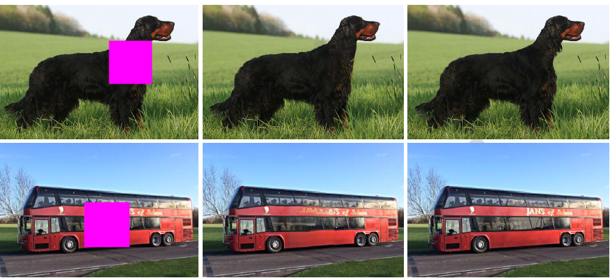

# CASI-Context-Aware-Semantic-Inpainting
<p align="center">
  
</p>

This is the code for `CASI: Context-Aware-Semantic-Inpainting' IEEE Transaction on Cybernetics 2018.

If you use this code, you need to cite the following paper
```
@article{li2018context-aware,
  title={Context-Aware Semantic Inpainting},
  author={Li, Haofeng and Li, Guanbin and Lin, Liang and Yu, Hongchuan and Yu, Yizhou},
  journal={IEEE Transactions on Systems, Man, and Cybernetics},
  pages={1--14},
  year={2018}
}
```
